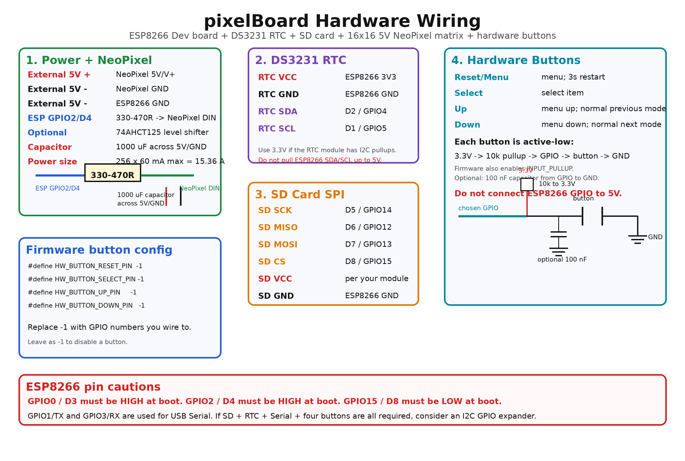

# pixelBoard

ESP8266 firmware for a 16x16 NeoPixel matrix with SD-card animations, a DS3231
RTC clock, web control, OTA updates, games, and a hardware setup menu.

## NTP server configuration

The firmware defaults to the public NTP pool:

```text
pool.ntp.org
```

You can override it from the SD card by creating this file:

```text
/ntpserver.txt
```

The first non-empty, non-comment line is used as the NTP hostname or IP address:

```text
# Optional SD-card NTP override
time.google.com
```

If the file is missing, empty, or cannot be opened, the firmware falls back to
`pool.ntp.org`.

## Clock menu

The Time menu shows a single WiFi clock setting instead of separate manual/NTP
items:

```text
WIFI CLOCK - ON
WIFI CLOCK - OFF
```

Press `Select` on that item to open an ON/OFF picker. Use `Up` or `Down` to
change the selection, then press `Select` again to save and return to the Time
menu.

When WiFi clock is `ON`, NTP responses update the DS3231 RTC using the selected
timezone offset. When it is `OFF`, the RTC keeps running by itself and the
firmware does not request periodic NTP time updates.

## Timezone localization

The clock menu uses short city labels because they fit better on the 16x16 LED
matrix than long timezone names. The firmware starts with a global whole-hour
offset list, then applies an optional country-specific file from the SD card.

The shipped SD card config selects Canada:

```text
/timezone_country.conf
CA
```

Startup order:

1. Load the built-in global timezone list.
2. Apply `/timezone_global.conf` from SD card if present.
3. Read the country code from `/timezone_country.conf`.
4. Apply `/<COUNTRY>_timezone.conf`, for example `/CA_timezone.conf`.

Country files replace labels for matching offsets. For example, the global list
may contain:

```text
LA,-8
```

Canada can replace the `-8` label with Vancouver:

```text
YVR,-8
```

Both of these formats are accepted:

```text
YVR,-8
{"YVR", "-8"}
{"-8", "YVR"}
```

Included SD-card examples:

```text
/timezone_global.conf
/timezone_country.conf
/CA_timezone.conf
/US_timezone.conf
```

Current limitation: this firmware stores whole-hour UTC offsets only. It does
not automatically apply daylight saving time rules.

## Hardware wiring

The firmware is written for an ESP8266 Dev board driving a 5V NeoPixel matrix.
The code currently creates the NeoPixel strip on **GPIO2**:

```cpp
Adafruit_NeoPixel strip = Adafruit_NeoPixel(BOARDSIZE, 2, NEO_GRB + NEO_KHZ800);
```

### Wiring diagram

See the JPEG wiring diagram. The editable source is also included as
[`docs/hardware-wiring.svg`](docs/hardware-wiring.svg).



### Power wiring

| Connection | Wire to | Notes |
| --- | --- | --- |
| 5V power supply `+` | NeoPixel matrix `5V` | Do not power 256 LEDs from the ESP8266 USB port. |
| 5V power supply `-` | NeoPixel matrix `GND` | Must also connect to ESP8266 `GND`. |
| 5V power supply `-` | ESP8266 `GND` | Required common ground for data signal. |
| ESP8266 `VIN` / `5V` | 5V supply `+` | Optional if not powering the ESP8266 by USB. |

For a 16x16 matrix, worst-case full white current is about:

```text
256 LEDs x 60 mA = 15.36 A
```

Use a 5V supply sized for your brightness. If you limit brightness in firmware,
the real current can be much lower, but the supply and wiring should still be
chosen safely.

Add these parts near the NeoPixel matrix:

| Part | Where | Why |
| --- | --- | --- |
| 330 to 470 ohm resistor | In series between ESP8266 GPIO2 and NeoPixel `DIN` | Protects the first pixel from data-line spikes. |
| 1000 uF electrolytic capacitor, 6.3V or higher | Across NeoPixel `5V` and `GND` | Absorbs LED power-up surges. Observe polarity. |
| 74AHCT125 / 74HCT245 level shifter | Between ESP8266 data and NeoPixel `DIN` | Recommended for reliable 3.3V-to-5V data conversion. Short wires may work without it, but the level shifter is safer. |

### ESP8266 Dev board pin map

| Module | ESP8266 Dev board pin | ESP8266 GPIO | Notes |
| --- | --- | --- | --- |
| NeoPixel `DIN` | `D4` | GPIO2 | Current firmware data pin. Put 330-470 ohm resistor in series. |
| NeoPixel `5V` | External 5V `+` | - | Use external LED power. |
| NeoPixel `GND` | External 5V `-` and ESP `GND` | - | All grounds must be common. |
| DS3231 RTC `SDA` | `D2` | GPIO4 | ESP8266 Arduino `Wire` default. |
| DS3231 RTC `SCL` | `D1` | GPIO5 | ESP8266 Arduino `Wire` default. |
| DS3231 RTC `VCC` | `3V3` | - | Prefer 3.3V so I2C pullups do not pull ESP pins to 5V. |
| DS3231 RTC `GND` | `GND` | - | Common ground. |
| SD card `SCK` | `D5` | GPIO14 | SPI clock. |
| SD card `MISO` | `D6` | GPIO12 | SPI MISO. |
| SD card `MOSI` | `D7` | GPIO13 | SPI MOSI. |
| SD card `CS` | `D8` | GPIO15 | `#define SD_CS 15` in the sketch. |

> Note: Many DS3231 modules include pullup resistors on SDA/SCL. If your module
> is powered from 5V, those pullups can put 5V on ESP8266 GPIO pins. Power the
> RTC from 3.3V or remove/change the pullups.

### Hardware button wiring

The firmware supports four configurable hardware buttons:

| Button | Firmware purpose |
| --- | --- |
| Reset/Menu | Short press opens/back-outs of the menu. Hold 3 seconds to software-reset the ESP8266. |
| Select | Selects the current menu item. |
| Up | Menu up / increase value. Outside the menu, cycles to the previous board mode. |
| Down | Menu down / decrease value. Outside the menu, cycles to the next board mode. |

Buttons are read as **active-low**:

```text
3.3V ---- 10k resistor ---- GPIO input ---- button ---- GND
```

The code also enables `INPUT_PULLUP`, so the external 10k pullup is optional for
short wires, but recommended for reliable hardware. Do **not** connect any
ESP8266 GPIO button input to 5V.

Optional button parts:

| Part | Where | Why |
| --- | --- | --- |
| 10k resistor | GPIO input to 3.3V | External pullup, keeps the input high when not pressed. |
| 100 nF capacitor | GPIO input to GND | Optional hardware debounce/noise filtering. |
| 220 ohm to 1k resistor | In series with GPIO input | Optional protection against wiring mistakes. |

Configure the button GPIOs in `bmpBoardWithOTA.ino` before flashing:

```cpp
#define HW_BUTTON_RESET_PIN  -1
#define HW_BUTTON_SELECT_PIN -1
#define HW_BUTTON_UP_PIN     -1
#define HW_BUTTON_DOWN_PIN   -1
```

Replace `-1` with the GPIO numbers you wire to. They are disabled while set to
`-1`.

Because this project already uses NeoPixel, SD/SPI, and I2C RTC pins, an
ESP8266 Dev board has very few completely free GPIOs. If you keep SD, RTC,
NeoPixel, USB Serial, and four buttons all connected, consider using an I2C GPIO
expander such as a PCF8574 for the buttons. If you wire buttons directly to the
ESP8266, choose pins carefully and avoid changing boot-strap pin levels during
reset.

Important ESP8266 pin cautions:

| GPIO | Dev board label | Caution |
| --- | --- | --- |
| GPIO0 | `D3` | Must be high at boot, or the ESP8266 enters flash mode. |
| GPIO2 | `D4` | Must be high at boot; this project uses it for NeoPixel data. |
| GPIO15 | `D8` | Must be low at boot; this project uses it for SD card CS. |
| GPIO1 / GPIO3 | `TX` / `RX` | Used for USB Serial; buttons here can interfere with Serial output/upload. |
| GPIO16 | `D0` | Special GPIO; usable for simple input, but different from other pins. |

The Reset/Menu button in this project is a **software menu/reset button**, not
the ESP8266 board `RST` pin. If you also want a physical hard reset button, wire
a separate momentary button from `RST` to `GND`; most Dev boards already include
the required reset pullup.

### Button and menu behavior

| State | Reset/Menu | Select | Up | Down |
| --- | --- | --- | --- | --- |
| Normal display/game mode | Short press opens menu; 3 second hold restarts | No action | Previous board mode | Next board mode |
| Setup menu | Back/exit; 3 second hold restarts | Select item | Previous item / increase value | Next item / decrease value |

Current board mode order:

```text
Pixel Art Traverse
Pixel Art Single
Solid Fill
Clock
Snake
Tetris
Game of Life
Arkanoid
```
